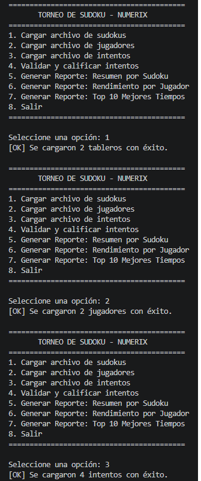
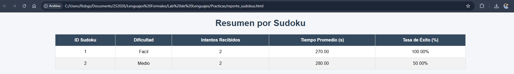
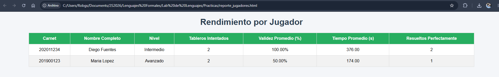
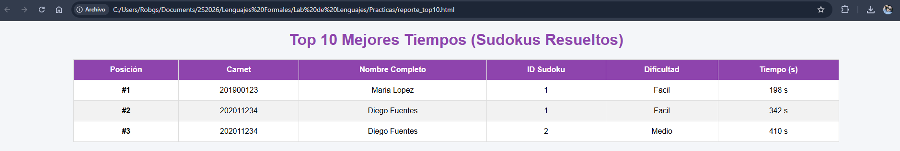

# Informe de Desarrollo — LFP Numerix

## 1. Introducción
Este informe documenta el proceso de implementación de LFP Numerix,
los retos técnicos encontrados durante el desarrollo y las soluciones
aplicadas.

## 2. Resumen del desarrollo
El sistema se desarrolló en Python aplicando Programación Orientada a
Objetos, separando el proyecto en módulos independientes: carga de
datos, validación matricial, generación de reportes y menú de
interacción con el usuario.

## 3. Retos técnicos y soluciones

### 3.1 Validación matricial del Sudoku
**Reto:** convertir una cadena de 81 caracteres en una matriz de 9x9 y
validar filas, columnas y cajas de 3x3 sin duplicar lógica.

**Solución:** se aisló la conversión en `cadena_a_matriz()` y se
implementó una función independiente por tipo de validación
(`validar_filas`, `validar_columnas`, `validar_cajas`), todas
reutilizando el mismo criterio: un grupo de 9 celdas es válido si
contiene 9 números distintos entre 1 y 9.

### 3.2 Respeto de las pistas originales
**Reto:** un intento podía cumplir las 27 validaciones matriciales
pero haber alterado una celda que ya tenía un valor fijo en el
tablero original.

**Solución:** se agregó `validar_respeto_pistas()`, que compara celda
por celda la matriz original contra la propuesta, y se combinó este
resultado con el de las 27 validaciones para determinar
`es_correcto`.

### 3.3 Archivos con formato incorrecto
**Reto:** una sola línea mal formada en un `.lfp` (por ejemplo, con
menos campos de los esperados) detenía la carga de todo el archivo.

**Solución:** se envolvió el procesamiento de cada línea en su propio
`try/except`, de forma que una línea inválida se omite e informa por
consola sin afectar el resto del archivo.

### 3.4 Relación entre archivos independientes
**Reto:** los tres archivos (`sudokus.lfp`, `jugadores.lfp`,
`intentos.lfp`) se cargan por separado, pero los reportes necesitan
cruzarlos por `id_sudoku` y `carnet`.

**Solución:** en cada reporte se filtran y relacionan las listas de
objetos en memoria (por ejemplo, `[i for i in intentos if
i.id_sudoku == t.id_sudoku]`), sin necesidad de una base de datos.

## 4. Capturas del sistema en funcionamiento

## 5. Resultados de los reportes generados

## 6. Conclusiones
- La separación en clases (`Tablero`, `Jugador`, `Intento`) facilitó
  mantener el código organizado y legible.
- Aislar la lógica de validación matricial en funciones pequeñas
  permitió probarlas de forma independiente antes de integrarlas al
  flujo completo.
- El manejo de excepciones por línea, aunque es opcional según el
  enunciado, hizo el sistema más robusto frente a archivos de datos
  reales, que rara vez están perfectamente formados.
