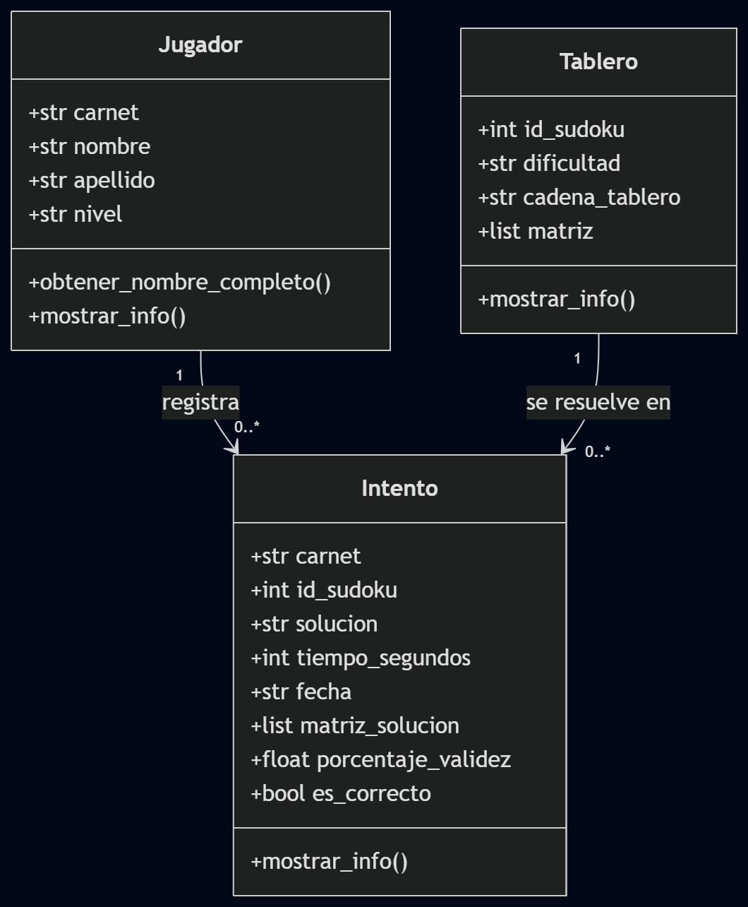
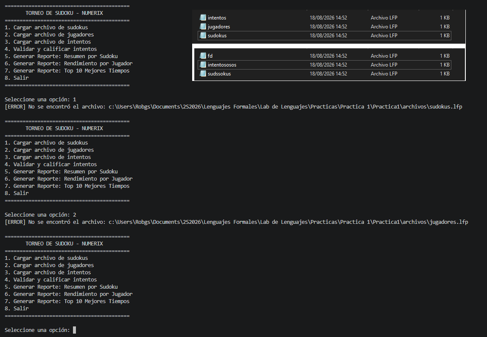

# Manual Técnico — LFP Numerix

## 1. Introducción
Este documento describe la arquitectura, las clases y la lógica de
validación matricial del sistema **LFP Numerix**, un motor de
calificación y análisis para torneos de Sudoku desarrollado en Python
aplicando Programación Orientada a Objetos.

## 2. Requerimientos técnicos
- Lenguaje: Python 3.x
- Librerías: solo librería estándar (no requiere `pip install`)
- Entorno recomendado: PyCharm, Visual Studio Code o IDLE
- Estructura de carpetas:

```
proyecto/
├── main.py
├── menu.py
├── carga_lfp.py
├── comprobaciones.py
├── reportes.py
├── tablero.py
├── jugador.py
├── intento.py
└── archivos/
    ├── sudokus.lfp
    ├── jugadores.lfp
    └── intentos.lfp
```

## 3. Arquitectura general
El proyecto sigue una separación por responsabilidades:

| Módulo | Responsabilidad |
|---|---|
| `main.py` | Punto de entrada, bucle principal del menú |
| `menu.py` | Opciones del menú y orquestación de las llamadas |
| `carga_lfp.py` | Lectura y parseo de los archivos `.lfp` |
| `comprobaciones.py` | Validación matricial del Sudoku |
| `reportes.py` | Generación de los 3 reportes HTML |
| `tablero.py`, `jugador.py`, `intento.py` | Clases del modelo (POO) |



## 4. Descripción de clases

### 4.1 Clase `Tablero`
Representa un tablero de Sudoku cargado desde `sudokus.lfp`.

| Atributo | Tipo | Descripción |
|---|---|---|
| `id_sudoku` | int | Identificador único del tablero |
| `dificultad` | str | Nivel declarado (Facil, Media, Dificil, Experto) |
| `cadena_tablero` | str | Cadena de 81 caracteres del tablero original |
| `matriz` | list[list[int]] | Representación 9x9 del tablero |

**Métodos:** `mostrar_info()`

### 4.2 Clase `Jugador`
Representa a un jugador inscrito en el torneo.

| Atributo | Tipo | Descripción |
|---|---|---|
| `carnet` | str | Identificador único del jugador |
| `nombre`, `apellido` | str | Datos personales |
| `nivel` | str | Categoría de experiencia |

**Métodos:** `obtener_nombre_completo()`, `mostrar_info()`

### 4.3 Clase `Intento`
Representa el intento de resolución de un tablero por parte de un jugador.

| Atributo | Tipo | Descripción |
|---|---|---|
| `carnet` | str | Jugador que realizó el intento |
| `id_sudoku` | int | Tablero resuelto |
| `solucion` | str | Cadena de 81 caracteres propuesta |
| `tiempo_segundos` | int | Tiempo empleado |
| `fecha` | str | Fecha del intento (DD-MM-AAAA) |
| `porcentaje_validez` | float | Resultado calculado en la validación |
| `es_correcto` | bool | True si el porcentaje es 100% y respeta las pistas |

**Métodos:** `mostrar_info()`

## 5. Lógica de validación matricial

### 5.1 De cadena a matriz
La cadena de 81 caracteres se recorre fila por fila para construir una
matriz de 9x9:

```
Para i en 0..8:
    Para j en 0..8:
        matriz[i][j] = entero(cadena[i * 9 + j])
```

### 5.2 Validación de filas, columnas y cajas
Para cada una de las 9 filas, 9 columnas y 9 cajas de 3x3 se verifica
que contenga los dígitos del 1 al 9 sin repetirse:

```
validas = 0
Para cada grupo (fila / columna / caja) de 9 celdas:
    numeros = [n para n en grupo si 1 <= n <= 9]
    Si len(numeros) == 9 Y len(conjunto(numeros)) == 9:
        validas += 1
```

El total de grupos válidos (máximo 27) se usa para calcular el
porcentaje de validez:

```
porcentaje = (filas_validas + columnas_validas + cajas_validas) / 27 * 100
```

### 5.3 Respeto de pistas
Se compara celda por celda la matriz original contra la matriz de la
solución propuesta. Si una celda original tenía un valor distinto de 0
(pista) y en la solución cambió, el intento no puede considerarse
100% correcto aunque las 27 validaciones matriciales se cumplan.

### 5.4 Criterio de intento correcto
Un intento se marca como `es_correcto = True` únicamente si:
1. Las 27 validaciones (filas + columnas + cajas) se cumplen, **y**
2. Todas las pistas originales fueron respetadas.

## 6. Manejo de excepciones
La carga de cada archivo `.lfp` captura errores por línea
(`IndexError`, `ValueError`) sin detener la carga completa: si una
línea está mal formada, se omite y se informa al usuario, y el resto
del archivo se sigue procesando con normalidad.


