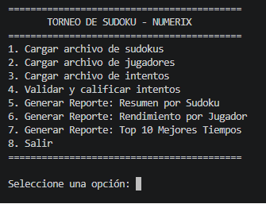
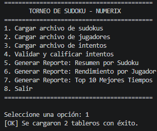
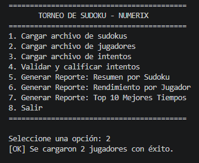
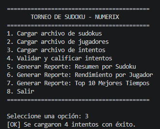
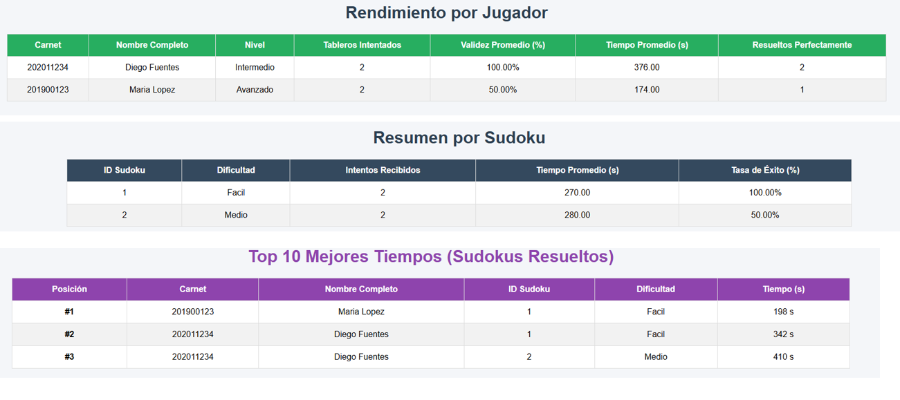

# Manual de Usuario — LFP Numerix

## 1. Introducción
LFP Numerix es un programa de consola que permite cargar tableros,
jugadores e intentos de un torneo de Sudoku, calificar los intentos y
generar reportes analíticos en formato HTML.

## 2. Requisitos previos
- Tener Python 3.x instalado.
- Contar con la carpeta `archivos/` junto al programa, con los
  archivos `sudokus.lfp`, `jugadores.lfp` e `intentos.lfp`.

## 3. Ejecución del programa
Desde la terminal, ubicado en la carpeta del proyecto:

```bash
python main.py
```

Al iniciar se muestra el menú principal:



## 4. Formato de los archivos de entrada

### 4.1 sudokus.lfp
```
id_sudoku,dificultad,tablero
1,Facil,003020600900305001001806400008102900700000008006708200002609500800203009005010300
```

### 4.2 jugadores.lfp
```
carnet,nombre,apellido,nivel
202011234,Diego,Fuentes,Intermedio
```

### 4.3 intentos.lfp
```
carnet,id_sudoku,solucion,tiempo_segundos,fecha
202011234,1,483921657967345821251876493548132976729564138136798245372689514814253769695417382,342,15-03-2026
```

## 5. Guía paso a paso

### Paso 1 — Cargar los sudokus (opción 1)
Lee `archivos/sudokus.lfp` y confirma cuántos tableros se cargaron.



### Paso 2 — Cargar los jugadores (opción 2)
Lee `archivos/jugadores.lfp`.



### Paso 3 — Cargar los intentos (opción 3)
Lee `archivos/intentos.lfp`.



### Paso 4 — Validar y calificar intentos (opción 4)
Aplica la validación matricial a cada intento cargado y muestra el
estado (CORRECTO o INCORRECTO) de cada uno.


> **Importante:** las opciones 1, 2 y 3 deben ejecutarse antes que la
> opción 4, y la opción 4 antes de generar los reportes.

### Paso 5, 6 y 7 — Generar reportes
Cada opción genera un archivo HTML en la carpeta del proyecto:

| Opción | Archivo generado | Contenido |
|---|---|---|
| 5 | `reporte_sudokus.html` | Resumen por Sudoku |
| 6 | `reporte_jugadores.html` | Rendimiento por Jugador |
| 7 | `reporte_top10.html` | Top 10 Mejores Tiempos |



### Paso 8 — Salir
Cierra el programa.

## 6. Solución de problemas comunes

| Problema | Causa probable | Solución |
|---|---|---|
| `[ERROR] No se encontró el archivo` | La carpeta `archivos/` no existe o el archivo no está ahí | Verificar que `sudokus.lfp`, `jugadores.lfp` e `intentos.lfp` estén en `archivos/` |
| `[!] Línea N ... se omite` | Una línea del `.lfp` no tiene el formato correcto | Revisar que la línea tenga el número de campos esperado separados por coma |
| Reporte vacío o con 0 intentos | No se ejecutó la opción 4 antes de generar el reporte | Ejecutar primero "Validar y calificar intentos" |
